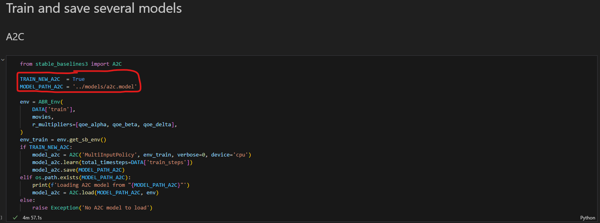

# RL-based-ABR-streaming

## Overview:
This project was developed as part of Purdue's ECE 59500 course, Reinforcement Learning. Designed for the Master’s program in Electrical and Computer Engineering, the course allowed for an open-ended exploration of a chosen topic within the field of reinforcement learning.

In this project, we explore the application of reinforcement learning (RL) in enhancing Adaptive Bitrate (ABR) video streaming over HTTP. Utilizing real-world network traces and open-source simulation tools, RL models outperform traditional ABR approaches, achieving significant reductions in rebuffering and bitrate variability. Despite the advancements, challenges in balancing QoE components remain. This work shows that RL has promise in ABR optimization and sets the stage for future developments in robust video streaming solutions.

## Getting Started:

For convienience purposes, a `Makefile` was written in order to simplify the process of 
setting up the repo. Note, this repo was developed and run on an Ubuntu 22 system 
as well as a WSL Ubuntu 22 system. The code is untested on windows and mac.  

Stable Baselines requires several packages. They can be installed with:
```
sudo make setup
``` 

Next, create a python environment with the command below. This installs all python packages 
required in the `.env` environment, and it also adds the environment to the jupyter notebook
kernels. Make sure to select the `.env` enviroment in vscode or in jupyter lab when running
this project. 
```
make env-create
```

If the environment is ever messed up, it can be wiped with:
```
make env-delete
```

## Project Structure:
Several folders were created for the project with all data and results that have been gathered. 

**Data:**  
All of the data for this experiment is contained within the `data/` folder. 
This includes several network traces and movies that were downloaded from the
[original sabre repository](https://github.com/UMass-LIDS/sabre/tree/master/example/mmsys18).  

The data is organized in the following manor:
* `/data/3Glogs`: 3G network traces
* `/data/4Glogs`: 4G network traces
* `/data/sd_fs`: sd FCC web traces
* `/data/hd_fs`: hd FCC web traces
* `/data/bbb.json`: dash manifest of the Big Buck Bunny movie; 4k version is also there

**Src:**  
The main code to for this project is contained within `src/main.ipynb`. This is a jupyter notebook that loads 
data, trains models, tests models, and generates results. 

The [Sabre](https://github.com/UMass-LIDS/sabre) ABR emulator tool was used to test the trained models in this experiement. 
Minor modifications were made to the Sabre implimentaion in order to run the tool in a jupyter notebook; the modified version 
is saved in `src/sabre.py`. Sabre tests ABR algorithms by loading python files that have the same name as the Class that defines 
the algorithm. Since the process of testing a model is the same across each instance, `ABR_Base.py` was created as a base ABR 
algorithm to load and test a RL model, and the remaining `ABR_XXXX.py` files inherit from this base just to load a spesific model.

The RL environment is contained in `src/environment.py`, and a helper class to interact with the sabre emulator is defined in `src/emulator.py`.
While it would have been nice to define these in the main notebook, sperate files were reqired in order to reuse the envrionment class 
for testing and training.  

**Models:**  
All of the models were saved in the `models/` folder in order to reduce the time to run the main code
when re-training is not required. For the two models, there is a boolean value that can be set in `src/main.ipynb`
to choose to re-train a model from scratch or load the saved one. This is shown below by setting the `TRAIN_NEW_A2C` 
and `MODEL_PATH_A2C` options for the A2C model. 



**Results:**  
The test results for all models was saved in the resutls folder in csv format. Here is what it looks like in pandas for reference:
```
<class 'pandas.core.frame.DataFrame'>
Index: 1000 entries, 0 to 249
Data columns (total 28 columns):
 #   Column                           Non-Null Count  Dtype  
---  ------                           --------------  -----  
 0   movie                            1000 non-null   object 
 1   network_trace                    1000 non-null   object 
 2   algorithm                        1000 non-null   object 
 3   buffer size                      1000 non-null   float64
 4   total played utility             1000 non-null   float64
 5   time average played utility      1000 non-null   float64
 6   total played bitrate             1000 non-null   float64
 7   time average played bitrate      1000 non-null   float64
 8   total play time                  1000 non-null   float64
 9   total play time chunks           1000 non-null   float64
 10  total rebuffer                   1000 non-null   float64
 11  rebuffer ratio                   1000 non-null   float64
 12  time average rebuffer            1000 non-null   float64
 13  total rebuffer events            1000 non-null   float64
 14  time average rebuffer events     1000 non-null   float64
 15  total bitrate change             1000 non-null   float64
 16  time average bitrate change      1000 non-null   float64
 17  total log bitrate change         1000 non-null   float64
 18  time average log bitrate change  1000 non-null   float64
 19  time average score               1000 non-null   float64
...
 26  total reaction time              1000 non-null   float64
 27  qoe                              1000 non-null   float64
dtypes: float64(25), object(3)
memory usage: 226.6+ KB
```
